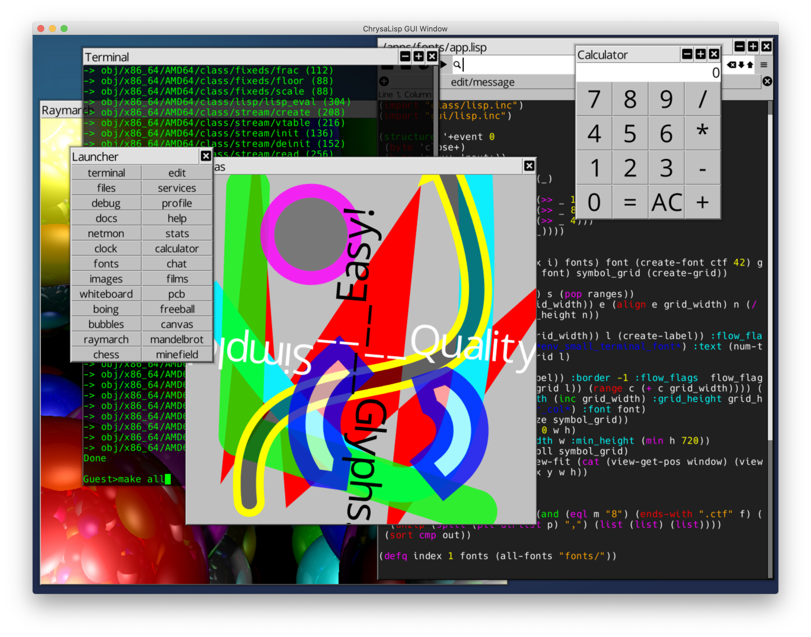
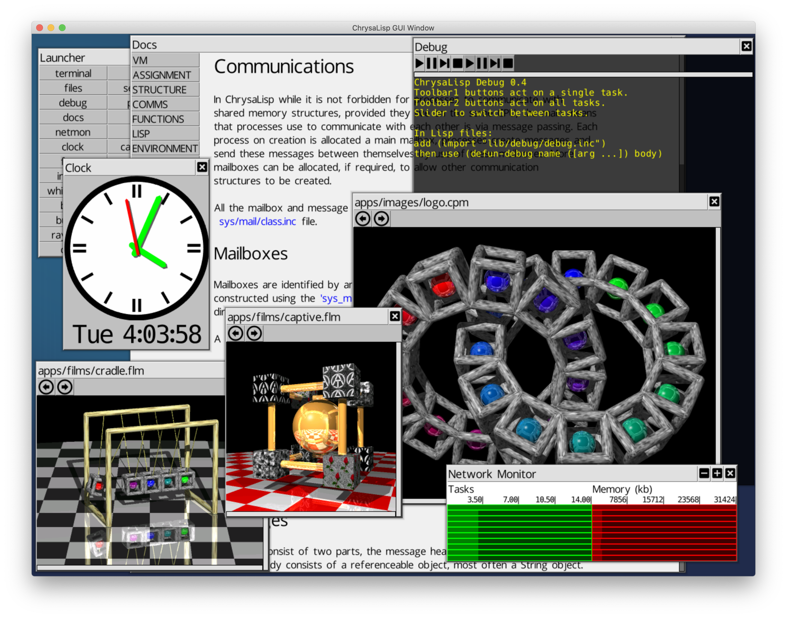
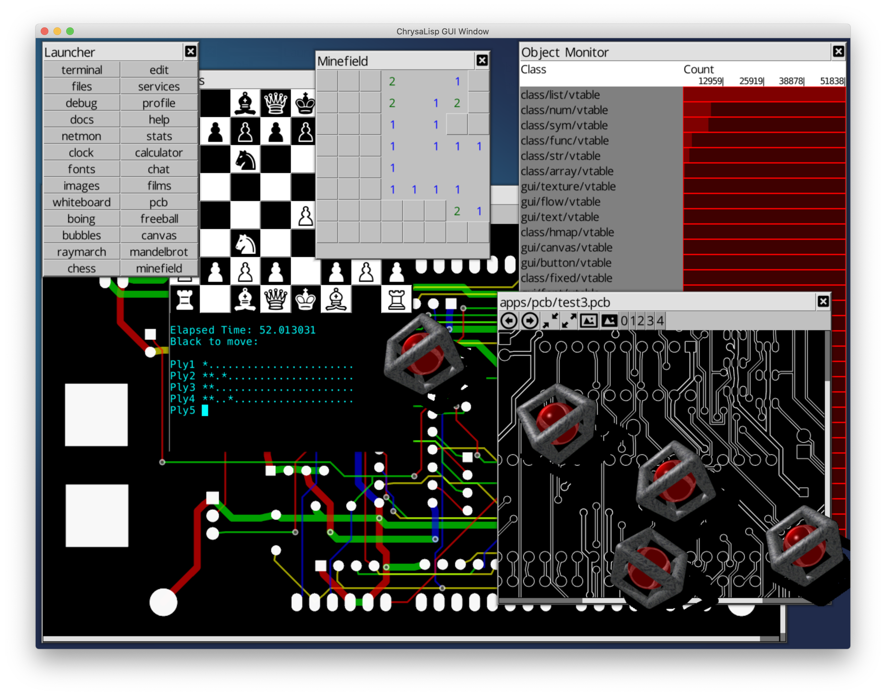
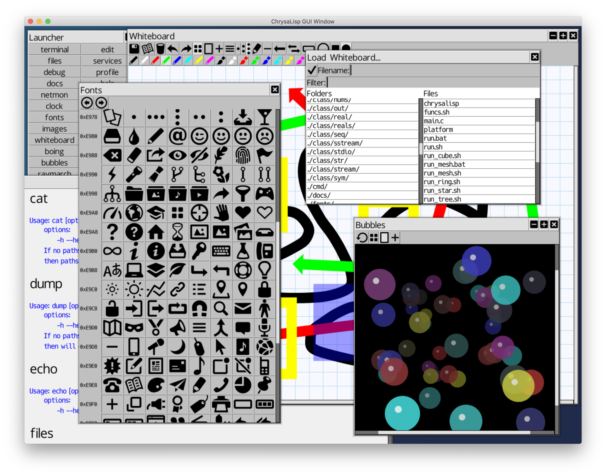
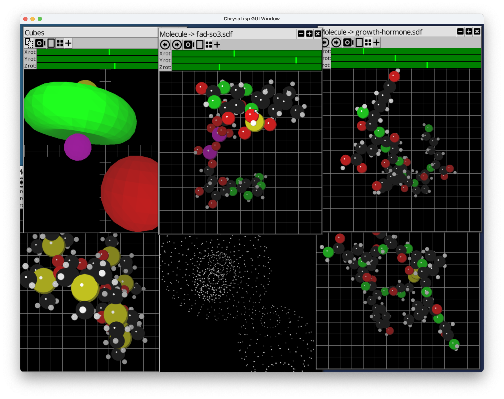

# ChrysaLisp

Assembler/C-Script/Lisp 64 bit, MIMD, multi CPU, multi threaded, multi core,
multi user Parallel OS. With GUI, Terminal, OO Assembler, Class libraries,
C-Script compiler, Lisp interpreter, Debugger, Profiler, Vector Font engine and
more...












It runs on MacOS, Windows or Linux for x64, MacOS or Linux for Aarch64. Will
move to bare metal eventually but it's useful for now to run hosted while
experimenting. When time allows I will be doing a VM boot image for UniKernel
type appliances and a WebAssembly target to play around within the browser.

You can model various network topologies with point to point links. Each CPU in
the network is modelled as a separate host process, point to point links use
shared memory to simulate CPU to CPU, point to point, bi directional
connections. There is no global bus based networking on purpose.

The usb-links branch has the ability to use a usb3/usb2 Prolific chip 'copy'
cable to join heterogeneous host networks ! This demonstrates that the
simulated peer to peer network on a single machine does actually translate to
real world parallel hardware ! Plus it's rather cool to string your MacBook and
Windows laptops together with your PI4's to create your own dev network.

There is a virtual CPU instruction set to avoid use of x64/ARM/VP64 native
instructions. Currently it compiles directly to native code but there is no
reason it can't also go via a byte code form and runtime translation.

Register juggling for parameter passing is eliminated by having all functions
define their register interface and parameter source and destinations are
mapped automatically using a topological sort. Non DAG mappings are detected so
the user can break them with a temporary if required. Operators are provided to
simplify binding of parameters to dynamic bound functions, relative addresses,
auto defined string pools, references and local stack frame values. Unused
output parameters can be ignored with an _.

There is a powerful object and class system, not just for an assembler, but
quite as capable as a high level language. Static classes or virtual classes
with inline, virtual, final, static and override methods can be defined. The
GUI and Lisp are constructed using this class system.

It has function level dynamic binding and loading. Individual functions are
loaded and bound on demand as tasks are created and distributed. Currently
functions are loaded from the CPU file system on which the task finds itself,
but these will eventually come from the server object that the task was created
with and functions will be transported across the network as required.
Functions are shared between all tasks that share the same server object, so
only a single copy of a function is loaded regardless of how many tasks use
that function.

The interface to the system functions is provided as a set of static classes,
easing use and removing the need to remember static function locations, plus
decoupling the source from changes at the system level. Look in the
*sys/xxx.inc* files to see the interface definitions.

A command terminal with a familiar interface for pipe style command line
applications is provided with args vector, stdin, stdout, stderr etc. Classes
for easy construction of pipe masters and slaves, with arbitrary nesting of
command line pipes. While this isn't the best way to create parallel
applications it is very useful for the composition of tools and hides all the
message passing behind a familiar streams based API.

A Common Lisp like interpreter is provided. This is available from the command
line, via the command `lisp`. To build the entire system type `(make)`,
calculates minimum compile workload, or `(make-all)` to do everything
regardless, at the Lisp command prompt. This Lisp has a C-Script 'snippets'
capability to allow mixing of C-Script compiled expressions within assignment
and function calling code. An elementary optimise pass exists for these
expressions. Both the virtual assembler and C-Script compiler are written in
Lisp, look in the *sys/code.inc*, *lib/asm/xxx.inc*, *sys/func.inc*,
*lib/trans/x64.inc*, *lib/trans/arm64.inc* and *lib/asm/vp.inc* for how this is
done. Some of the Lisp primitives are constructed via a boot script that each
instance of a Lisp class runs on construction, see *class/lisp/boot.inc* for
details. The compilation and make environment, along with all the compile and
make commands are created via the Lisp command line tool in *lib/asm/asm.inc*,
again this auto runs for each instance of the `lisp` command run from the
terminal. You can extend this with any number of additional files, just place
them after the lisp command and they will execute after the *lib/asm/asm.inc*
file and before processing of stdin.

Don't get the idea that due to being coded in interpreted Lisp the assembler
and compiler will be slow. A fully cleaned system build from source, including
creation of a full recursive pre-bound boot image file, takes on the order of 2
seconds on a 2014 MacBook Pro ! Dev cycle `(make)` and `(remake)` under 0.5
seconds. It ain't slow !

Network link routing tables are created on booting a link, and the process is
distributed in nature, each link starts a flood fill that eventually reaches
all the CPU's and along the way has marked all the routes from one CPU to
another. All shortest routes are found, messages going off CPU are assigned to
a link as the link becomes free and multiple links can and do route messages
over parallel routes simultaneously. Large messages are broken into smaller
fragments on sending and reconstructed at the destination to maximize use of
available routes.

The `-run` command line option launches tasks on booting that CPU, such as the
experimental GUI (a work in progress, `-run gui/gui/gui.lisp`). You can change
the network launch script to run more than one GUI session if you want, try
launching the GUI on more than CPU 0, look in *funcs.sh* at the `boot_cpu_gui`
function ! :)

The `-l` command line option creates a link, currently up to 1000 CPU's are
allowed but that's easy to adjust. The shared memory link files are created in
the tmp folder */tmp*, so for example */tmp/000-001* would be the link file for
the link between CPU 000 and 001.

An example network viewed with ps looks like this for a 4x4 mesh network:

```
./main_gui -l 011-015 -l 003-015 -l 014-015 -l 012-015
./main_gui -l 010-014 -l 002-014 -l 013-014 -l 014-015
./main_gui -l 009-013 -l 001-013 -l 012-013 -l 013-014
./main_gui -l 008-012 -l 000-012 -l 012-015 -l 012-013
./main_gui -l 007-011 -l 011-015 -l 010-011 -l 008-011
./main_gui -l 006-010 -l 010-014 -l 009-010 -l 010-011
./main_gui -l 005-009 -l 009-013 -l 008-009 -l 009-010
./main_gui -l 004-008 -l 008-012 -l 008-011 -l 008-009
./main_gui -l 003-007 -l 007-011 -l 006-007 -l 004-007
./main_gui -l 002-006 -l 006-010 -l 005-006 -l 006-007
./main_gui -l 001-005 -l 005-009 -l 004-005 -l 005-006
./main_gui -l 000-004 -l 004-008 -l 004-007 -l 004-005
./main_gui -l 003-015 -l 003-007 -l 002-003 -l 000-003
./main_gui -l 002-014 -l 002-006 -l 001-002 -l 002-003
./main_gui -l 001-013 -l 001-005 -l 000-001 -l 001-002
./main_gui -l 000-012 -l 000-004 -l 000-003 -l 000-001 -run gui/gui
```

## Getting Started

Take a look at the `docs/INTRO.md` for instructions to get started on all the
supported platforms.

The experimental GUI requires the **SDL2** library to be installed.

Download these from the SDL web site.

- [SDL](https://www.libsdl.org/download-2.0.php)

Or get them via your package manager.

```
sudo apt-get install libsdl2-dev
```

## Make/Run/Stop

Take a look at the `docs/INTRO.md` for platform specific instructions. The
following is for OSX and Linux systems. Windows has a pre-built main.exe
provided, or you can configure Visual Studio to compile things yourself if you
wish.

### Installing

The first time you download ChrysaLisp you will only have the vp64 emulator
boot image. You must create the native boot images the first time round. This
is a little slower than subsequent boots and system compiles but allows us to
keep the snapshot.zip file as small as possible.

```
make install
```

Or on Windows

```
install.bat
```

### Make

```
make
```

### Run

```
./run_tui.sh [-n num_cpus] [-e] [-b base_cpu]
```

Text user interface based fully connected network. Each CPU has links to every
other CPU. Careful with this as you can end up with a very large number of link
files and shared memory regions. CPU 0 launches a terminal to the host system.

```
./run.sh [-n num_cpus] [-e] [-b base_cpu]
```

Fully connected network. Each CPU has links to every other CPU. Careful with
this as you can end up with a very large number of link files and shared memory
regions. CPU 0 launches a GUI.

```
./run_star.sh [-n num_cpus] [-e] [-b base_cpu]
```

Star connected network. Each CPU has a link to the first CPU. CPU 0 launches a
GUI.

```
./run_ring.sh [-n num_cpus] [-e] [-b base_cpu]
```

Ring connected network. Each CPU has links to the next and previous CPU's. CPU
0 launches a GUI.

```
./run_tree.sh [-n num_cpus] [-e] [-b base_cpu]
```

Tree connected network. Each CPU has links to its parent CPU and up to two
child CPU's. CPU 0 launches a GUI.

```
./run_mesh.sh [-n num_cpus on a side] [-e] [-b base_cpu]
```

Mesh connected network. Each CPU has links to 4 adjacent CPU's. This is similar
to Transputer meshes. CPU 0 launches a GUI.

```
./run_cube.sh [-n num_cpus on a side] [-e] [-b base_cpu]
```

Cube connected network. Each CPU has links to 6 adjacent CPU's. This is similar
to TMS320C40 meshes. CPU 0 launches a GUI.

### Stop

Stop with:

```
./stop.sh
```

### Snapshot

Snapshot with:

```
make snapshot
```

This will create a *snapshot.zip* file of the *obj/* directory containing only
the host directory structures, the pre-compiled Windows *main_gui.exe* and
*main_tui.exe* plus the VP64 *boot_image* files !

Used to create the more compact *snapshot.zip* that goes up on Github. This
must come after creation of `(make-all-platforms)` *boot_image* set !

```
obj/x86_64/AMD64/Darwin/
obj/x86_64/AMD64/Linux/
obj/aarch64/ARM64/Linux/
obj/aarch64/ARM64/Darwin/
obj/vp64/VP64/sys/boot_image
obj/x86_64/WIN64/Windows/main_gui.exe
obj/x86_64/WIN64/Windows/main_tui.exe
```

### Clean

Clean with:

```
make clean
```
